# `react-native-skia-grid` — Internals Deep Dive

> **Read this when you need to follow the data.** This doc traces every load-bearing path end-to-end: how a tap reaches a manager, how a filter change reaches a Skia picture, how a pan moves the viewport. Every claim is anchored to a `file:line` link.
>
> **Sibling docs:**
> - [architectural-overview.md](architectural-overview.md) — *what's where* (folder map, package conventions)
> - [performance-optimizations.md](performance-optimizations.md) — *why it's fast* (perf model, deferred values, layer cascade)
> - [density-plan.md](density-plan.md) — *what's next* (density tokens, styled-components migration)
> - [../ARCHITECTURE.md](../ARCHITECTURE.md) — *target/aspirational* (some names don't match current code)
>
> This doc is **as-is** documentation of the runtime. No edits, no plans.

## Table of Contents

1. [Big picture](#1-big-picture)
2. [Public entry point](#2-public-entry-point)
3. [The engine: `GridEngine` + `Manager` + `EventBus`](#3-the-engine-gridengine--manager--eventbus)
4. [State ownership at a glance](#4-state-ownership-at-a-glance)
5. [Row generation: raw `T[]` → `RowNode<T>[]` → rendered output](#5-row-generation-raw-t--rownodet--rendered-output)
6. [Column generation: defs → flat → internal columns](#6-column-generation-defs--flat--internal-columns)
7. [The pipeline: filter → (group \| sort)](#7-the-pipeline-filter--group--sort)
8. [Column actions UI flow](#8-column-actions-ui-flow)
9. [The Skia renderer: 8 picture layers](#9-the-skia-renderer-8-picture-layers)
10. [Scroll, pan, and hit testing](#10-scroll-pan-and-hit-testing)
11. [End-to-end traces (sequence diagrams)](#11-end-to-end-traces-sequence-diagrams)
12. [Constants & gotchas](#12-constants--gotchas)

---

## 1. Big picture

The package is layered into four logical regions. The arrows are the only directions imports may flow:

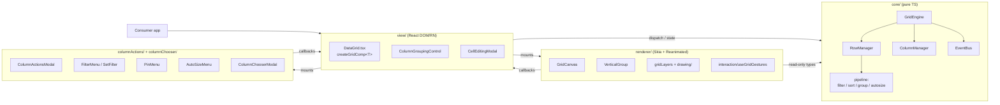

`core/` knows nothing about React, Skia, or RN. `renderer/` doesn't dispatch commands or read engine state — it consumes data via props from `view/` and reports gestures back via callbacks. `view/` is the only seam that knows about all three.

The full folder map and conventions live in [architectural-overview.md](architectural-overview.md). This doc focuses on flow.

---

## 2. Public entry point

The public barrel is [src/index.ts](../src/index.ts). The main consumer surface is the typed grid component returned from `createGridComp<T>()`:

```ts
import { createGridComp, Grid } from "react-native-skia-grid";

const MyGrid = createGridComp<MyRowType>();   // typed factory
// or
<Grid rows={...} columnDefs={...} />;          // untyped default export
```

[`createGridComp<T>()`](../src/view/DataGrid.tsx#L80) returns a `forwardRef`'d component. Each call produces a fresh component identity — that's why typed grids are usually memoized at module scope.

The component accepts roughly four families of props:
- **Data**: `rows`, `getRowId`, `pinnedTopRow`, `context`, `aggFuncs`
- **Columns**: `columnDefs`, `defaultColumnDefs`, `columnTypes`, `autoGroupColumnDefs`
- **Behavior**: `rowSelection`, `rowSelectWithPress`, `suppressGroupChangesColumnVisibility`, density
- **UI**: `theme`, `slots`, `components` (cell editor registry), `fontManager`, callbacks (`onRowPress`, `onCellEditingStopped`, …)

All inbound props eventually become **commands dispatched into the engine** (rows, columns, sort, filter, group, context, aggFuncs) or **React state** retained on `DataGrid` (selection, modal visibility, density, theme).

---

## 3. The engine: `GridEngine` + `Manager` + `EventBus`

The engine has **no grid state**. It is a typed command router and event bus with batching.

[src/core/GridEngine.ts:13-96](../src/core/GridEngine.ts#L13-L96):

```ts
export class GridEngine implements EngineHost {
  private readonly bus = new EventBus<GridEvent>();
  private managers: Manager[] = [];
  private batchDepth = 0;
  private pendingEmits: GridEvent[] = [];

  register(manager: Manager): void { manager.init?.(this); this.managers.push(manager); }
  dispatch(command: GridCommand): void {
    for (const m of this.managers) if (m.handle(command)) return;
  }
  batch(fn: () => void): void { /* increments depth, fn(), flushes on outermost finally */ }
  emit(event: GridEvent): void { /* if batchDepth > 0, queue; else fire */ }
  on(type, listener): Unsubscribe { return this.bus.on(type, listener); }
  dispose(): void { /* tears down managers + bus */ }
}
```

### The cascade-aware flush

The whole reason batching exists: `DataGrid`'s combined dispatch effect ([DataGrid.tsx:307-337](../src/view/DataGrid.tsx#L307-L337)) issues five commands per commit (`SetColumns`, `SetGroup`, `SetSort`, `SetContext`, `SetAggFuncs`). Without batching that's five `RowsChanged` emits → five `useSyncExternalStore` re-renders → five 8-layer picture re-records. On a 5000-row grid that stacks into seconds of jank.

[`flushPending()`](../src/core/GridEngine.ts#L57-L71) does two things at once:
1. **Dedup by event type** — `byType.set(event.type, event)` keeps only the *latest* event per type.
2. **Cascade-aware rounds** — flushing is itself batched. When a listener (e.g. RowManager hearing `ColumnsChanged`) emits a follow-up event (`RowsChanged`), it queues into the *next* round instead of firing in the middle. The loop terminates when a round produces no new emits — typical cascades bottom out in 1–2 rounds.

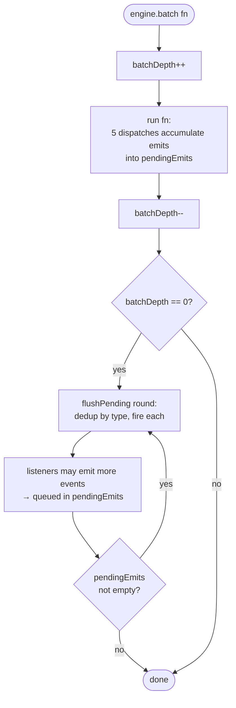

### `Manager` interface

Every manager implements [`Manager`](../src/core/types/engine.ts):

```ts
interface Manager {
  init?(host: EngineHost): void;
  handle(command: GridCommand): boolean;   // true = consumed, false = pass on
  dispose?(): void;
}
```

`dispatch` walks `managers` in registration order; the first to return `true` wins. Order matters: `DataGrid` registers `RowManager` *before* `ColumnManager` ([DataGrid.tsx:138-145](../src/view/DataGrid.tsx#L138-L145)) so that row-side command types take precedence in case of routing collisions. (Historically `RowCommandTypes.SetColumns` and `ColumnCommandTypes.SetColumns` both used the literal `"columns:set"` — RowManager's handler has since been deleted to remove that ambiguity. See [architectural-overview.md §13](architectural-overview.md#13-recent-migration-history-phase-2x--apr-may-2026).)

### `RowManager` — the pipeline owner

[src/core/managers/RowManager.ts](../src/core/managers/RowManager.ts) owns:
- `rowsData` — the input array (set via `RowCommandTypes.SetRows`)
- `context`, `aggFuncs` — pipeline-affecting user state
- `currentRows` — pipeline output (rendered)
- `currentFilteredRows` — post-filter / pre-group intermediate (used by `forEachNodeAfterFilter` and the Set filter's distinct-values flow)
- `lastInputs` — memoization snapshot

It **mirrors** (does not own) `columns`, `filterState`, `sortStatus`, `groupedColumns` via subscriptions in [`init()`](../src/core/managers/RowManager.ts#L106-L130):

```ts
init(host: EngineHost): void {
  this.host = host;
  this.unsubscribes.push(
    host.on(ColumnEventTypes.ColumnsChanged, (e) => { this.columns       = (e as ColumnsChangedEvent<T>).columns;       this.recompute(); }),
    host.on(ColumnEventTypes.FilterChanged,  (e) => { this.filterState   = (e as FilterChangedEvent).filterState;       this.recompute(); }),
    host.on(ColumnEventTypes.SortChanged,    (e) => { this.sortStatus    = (e as SortChangedEvent).sortStatus ?? [];    this.recompute(); }),
    host.on(ColumnEventTypes.GroupChanged,   (e) => { this.groupedColumns= (e as GroupChangedEvent<T>).groupedColumns;  this.recompute(); }),
  );
}
```

[`recompute()`](../src/core/managers/RowManager.ts#L178-L230) bails out by reference equality on all 7 inputs:

```ts
if (
  this.lastInputs !== null &&
  this.lastInputs.rowsData       === this.rowsData &&
  this.lastInputs.columns        === this.columns &&
  this.lastInputs.filterState    === this.filterState &&
  this.lastInputs.sortStatus     === this.sortStatus &&
  this.lastInputs.groupedColumns === this.groupedColumns &&
  this.lastInputs.context        === this.context &&
  this.lastInputs.aggFuncs       === this.aggFuncs
) return;
```

Why: the combined dispatch effect re-fires every sub-dispatch on any single change. Most of those carry unchanged references — without this guard every commit would allocate a new output array and emit `RowsChanged`.

[`replaceRenderedRows(rows)`](../src/core/managers/RowManager.ts#L173-L176) is the escape hatch: it sets `currentRows` directly *without touching `lastInputs`*, used only for row expand/collapse where the new rendered shape is computed outside the pipeline. It does not invalidate the memo, so a subsequent no-op dispatch won't overwrite the expanded array.

### `ColumnManager` — column state owner with granular events

[src/core/managers/ColumnManager.ts](../src/core/managers/ColumnManager.ts) owns columns + every column-derived piece of state:

| Command | Effect | Event emitted |
|---|---|---|
| `SetColumns` | replace columns | `ColumnsChanged` |
| `Resize` | one width changed | `ColumnsResized` *(width-only)* |
| `Pin` | `pinned` field changed on one column | `ColumnsChanged` |
| `SetVisibility` | `hide` field changed on one column | `ColumnsChanged` |
| `Reorder` | sort by `orderedIds[]` | `ColumnsChanged` |
| `SetSort` | replace sort status | `SortChanged` |
| `SetFilter` | replace filter map | `FilterChanged` |
| `SetGroup` | replace grouped column list | `GroupChanged` |
| `SetSectionWidth` | left/center/right section widths | `SectionResized` *(layout-only)* |

The granularity matters: **RowManager subscribes to `ColumnsChanged`/`FilterChanged`/`SortChanged`/`GroupChanged` but NOT `ColumnsResized` or `SectionResized`**. A column-width drag therefore never recomputes the row pipeline.

### `EventBus`

[src/core/eventBus.ts](../src/core/eventBus.ts) is ~30 lines: a `Map<type, Set<listener>>` plus an `all` set for `onAny`. `emit` iterates the listener set for the event type plus the `all` set. No retention, no replay.

---

## 4. State ownership at a glance

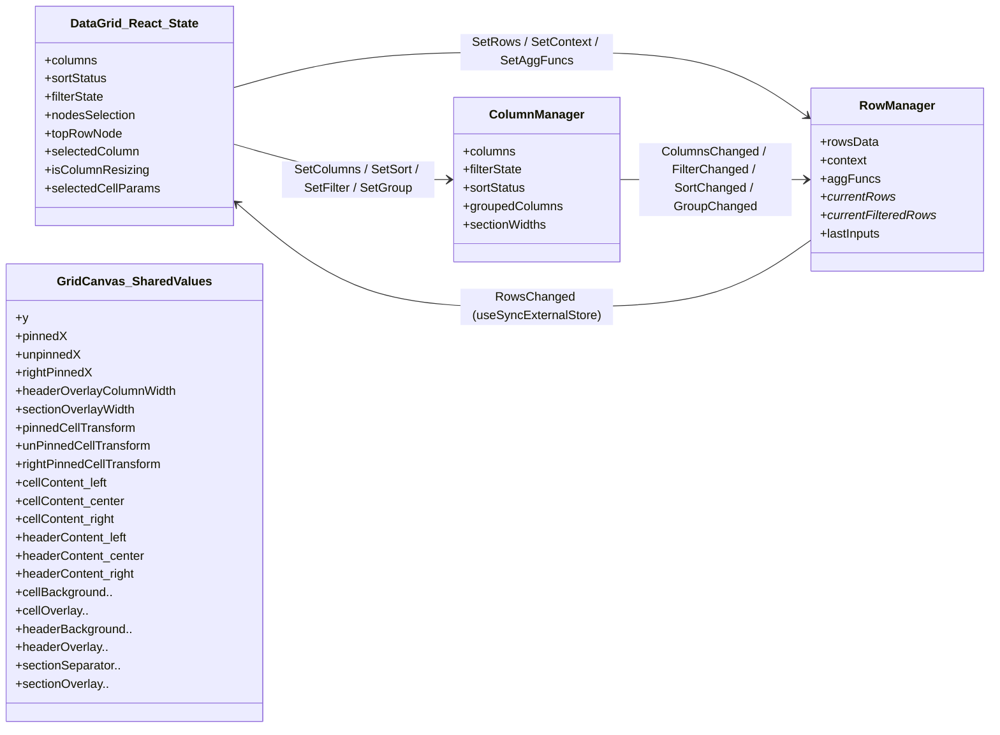

| State | Owner | Set via | Observed via |
|---|---|---|---|
| `rows` (input) | `RowManager` | `RowCommandTypes.SetRows` | `rowManager.getRows()` (post-pipeline) |
| `context`, `aggFuncs` | `RowManager` | `SetContext` / `SetAggFuncs` | (used inside pipeline only) |
| `columns` | `DataGrid` React state + `ColumnManager` mirror | `setColumns(newCols)` → `SetColumns` dispatch | `useGridActions().columns`, `ColumnsChanged` |
| `sortStatus` | `DataGrid` React state + `ColumnManager` mirror | `setSortStatus()` → `SetSort` dispatch | `SortChanged` |
| `filterState` | `DataGrid` React state + `ColumnManager` mirror | `setFilterState()` → debounced `SetFilter` dispatch | `FilterChanged` |
| `groupedColumns` | derived from `columns.filter(c => c.rowGroup)` | written into `SetGroup` inside batch effect | `GroupChanged` |
| `sectionWidths` | `ColumnManager` | `SetSectionWidth` | `SectionResized` |
| `currentRows`, `currentFilteredRows` | `RowManager` (computed) | `recompute()` / `replaceRenderedRows()` | `RowsChanged` → `useSyncExternalStore` |
| `nodesSelection` | `DataGrid` React state | `setNodesSelection` | context |
| Scroll offsets `y`/X | `GridCanvas` Reanimated `SharedValue<number>` | gesture `onActive` mutates `.value` | `useDerivedValue` → transform/clip |
| Picture layers | `GridCanvas` `SharedValue<SkPicture>` (8) | layer hooks call `recordPicture` | `<Picture picture={sv}>` in `VerticalGroup` |

**Key invariant**: RowManager has no `SetColumns`/`SetFilter`/`SetSort`/`SetGroup` command handlers anymore — those live on ColumnManager exclusively. RowManager only reacts to events.

---

## 5. Row generation: raw `T[]` → `RowNode<T>[]` → rendered output

### Step 1 — `transformDataToRowNode`

[src/utils/gridUtils.ts:244-260](../src/utils/gridUtils.ts#L244-L260):

```ts
export function transformDataToRowNode<T>(data: T[], getRowId?: (rowData: T) => string) {
  return data.map((i, idx) => ({
    id:       getRowId?.(i) ?? uuidv4(),
    __index:  idx,
    __id:     getRowId?.(i) ?? uuidv4(),
    data:     i,
    group:    false,
    level:    0,
    children: [],
  })) as RowNode<T>[];
}
```

⚠️ **Without `getRowId`, every call generates fresh UUIDs.** Selection, expand state, and any other ID-keyed maps will lose their entries on the next data turnaround. Pass `getRowId` for any non-trivial row data.

### Step 2 — dispatch into `RowManager`

[DataGrid.tsx:288-299](../src/view/DataGrid.tsx#L288-L299):

```ts
React.useEffect(() => {
  if (!isEqual(previousRowsBaseRef.current, rowsBase)) {
    const newRows = transformDataToRowNode(rowsBase, getRowId);
    previousRowsBaseRef.current = rowsBase;
    rowsDataRef.current = newRows;
    resetColumnWidthCache(newRows);
    engine.dispatch({ type: RowCommandTypes.SetRows, rows: newRows } as RowManagerCommand<T>);
  }
}, [rowsBase, engine]);
```

`lodash.isEqual` does deep-equality so `[...rows]` (new outer reference, same content) is a no-op. The width cache is repopulated chunked (100 rows per macrotask) by [`resetColumnWidthCache`](../src/view/DataGrid.tsx#L195-L232) — without chunking the `font.measureText` calls block the JS thread for seconds on first mount of a 5000-row grid.

### Step 3 — combined dispatch effect

[DataGrid.tsx:307-337](../src/view/DataGrid.tsx#L307-L337) wraps everything else in `engine.batch`:

```ts
React.useEffect(() => {
  engine.batch(() => {
    engine.dispatch({ type: ColumnCommandTypes.SetColumns, columns });
    const groupedColumns = sortBy(columns.filter(x => x.rowGroup), c => c.rowGroupIndex);
    engine.dispatch({ type: ColumnCommandTypes.SetGroup, groupedColumns });
    engine.dispatch({ type: ColumnCommandTypes.SetSort,  sortStatus });
    engine.dispatch({ type: RowCommandTypes.SetContext,  context });
    engine.dispatch({ type: RowCommandTypes.SetAggFuncs, aggFuncs });
  });
}, [engine, columns, sortStatus, context, aggFuncs]);
```

Five dispatches → ColumnManager fires 3 events (`ColumnsChanged`, `GroupChanged`, `SortChanged`) → RowManager listeners each call `recompute()` → 3 `RowsChanged` emits queue → flush rounds dedup to **1** `RowsChanged` → 1 React re-render. The other two RowManager command handlers (`SetContext`, `SetAggFuncs`) also call `recompute()`, but the reference-equality bail-out skips redundant pipeline runs when nothing changed.

### Step 4 — React reads via `useSyncExternalStore`

[DataGrid.tsx:155-164](../src/view/DataGrid.tsx#L155-L164):

```ts
const subscribeRows = React.useCallback(
  (notify) => engine.on(RowEventTypes.RowsChanged, () => notify()),
  [engine]
);
const getRowsSnapshot = React.useCallback(() => rowManager.getRows(), [rowManager]);
const rows = React.useSyncExternalStore(subscribeRows, getRowsSnapshot);
```

`rowManager.getRows()` returns a stable reference between recomputes — `useSyncExternalStore` doesn't warn about unstable snapshots.

### Step 5 — `replaceRenderedRows` for expand/collapse

[`setRowExpandedState`](../src/view/DataGrid.tsx#L699-L768) builds a new flat array by walking `rowManager.getRows()` and either inlining a group's sorted children (expand) or filtering out descendants by `groupKey` prefix (collapse), then calls `rowManager.replaceRenderedRows(nextRows)`. This emits `RowsChanged` without going through the filter/sort/group pipeline.

---

## 6. Column generation: defs → flat → internal columns

```mermaid
flowchart LR
  CD["columnDefs<br/>(SkiaGridColumnDef[])"] --> FL["flattenColumnDefs<br/>recursively unwrap<br/>SkiaColGroupDef.children"]
  FL --> M["mapToInternalColumns<br/>defaults &lt; def &lt; columnTypes[type]<br/>fill id, __id, __index, colId"]
  M --> SC["setColumns<br/>(in DataGrid)"]
  SC --> AUTO["auto-prepend<br/>__GROUP__ column<br/>if any rowGroup"]
  AUTO --> SEL["auto-prepend<br/>selection column<br/>if any checkboxSelection"]
  SEL --> ST["columns React state"]
  ST --> DISP["batched dispatch:<br/>SetColumns + SetGroup + SetSort"]
  DISP --> CM[ColumnManager]
  CM -- ColumnsChanged --> RM[RowManager.recompute]
```

- [`flattenColumnDefs`](../src/utils/columnGroupUtils.ts) recursively unwraps any `SkiaColGroupDef` (any def with a `children: SkiaGridColumnDef[]` array)
- [`mapToInternalColumns`](../src/utils/columnGroupUtils.ts) merges `defaultColumnDefs < user def < columnTypes[def.type]`, then assigns `id ?? `${idx}``, `__id`, `__index`, `colId ?? field`. The result is `SkiaInternalGridColumn<T>[]` where `id`, `__id`, `__index` are non-optional.
- [`setColumns`](../src/view/DataGrid.tsx#L441-L516) is the React-state setter that also auto-prepends synthetic columns:
  - A `__GROUP__` column (using `autoGroupColumnDefs` if provided, else a default with [`GroupCellRenderer`](../src/renderer/cellRenderers/GroupCellRenderer.tsx)) when any column has `rowGroup: true`
  - A selection column (using [`SelectionCellRenderer`](../src/renderer/cellRenderers/SelectionCellRenderer.tsx)) when any column has `checkboxSelection: true`
- It also derives a **`sortStatus`** from `column.sort` + `column.sortIndex` and writes it via `setSortStatus` so the next batched dispatch picks it up.

---

## 7. The pipeline: filter → (group | sort)

[`recompute()`](../src/core/managers/RowManager.ts#L198-L218) is the canonical pipeline:

```ts
let filtered = [...this.rowsData];
if (this.filterState.size) {
  filtered = getFilteredRows(filtered, this.filterState, this.columns);
}
this.currentFilteredRows = filtered;

let result: RowNode<T>[];
if (this.groupedColumns.length) {
  result = groupRows(this.currentRows, filtered, this.groupedColumns, this.columns, this.sortStatus, this.context, this.aggFuncs);
} else {
  result = sortRows(filtered, this.columns, this.sortStatus);
}
this.currentRows = result;
```

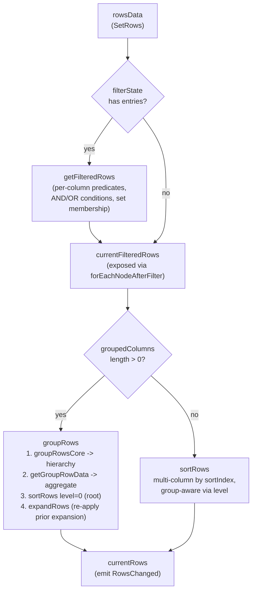

### Filter — [`getFilteredRows`](../src/core/pipeline/filter.ts)

For each entry in `filterState: Map<filterKey, ColumnFilterState>`:
- Look up the column via `getFilterKey(col)` (typically `col.colId ?? col.field`).
- For each filter slot in `state.filters[]`:
  - `filterType === "set"` → membership check against `(value as SetFilterType).values` using the column's display value.
  - Otherwise → `getFilteringFunction(model, column, filterType, filterParams)` builds a predicate per condition; predicates within a `CombinedFilterModel` are AND/OR-joined per `joinOperator`. Text filters honor `caseSensitive`, `trimInput`, optional custom `textMatcher`. Numeric and date filters support range queries (`InRange` with `filterTo`), comparisons, and `Blank`/`NotBlank` short-circuits.

### Sort — [`sortRows(rows, columns, sortStatus, level?)`](../src/core/pipeline/sort.ts)

- Sort entries by ascending `sortIndex` for stable multi-column behavior.
- For each entry, compare row values pairwise; first non-zero comparison wins.
- Value extraction (`getRowValue`):
  - Group rows → read from `row.groupRowData[col.field]`
  - Otherwise → `col.sortValueGetter?.({row, column, value})` if provided, else `getColumnValue(row, col)` (raw `valueGetter` or `get(row.data, col.field)`)
- `sortByAbsoluteValue` flag swaps to `Math.abs` for both sides.
- Null/`undefined`/`"NaN"` sort to the end regardless of direction.
- Group-aware: if `column.rowGroup` and `column.rowGroupIndex !== level`, the entry is skipped at this level — leaf-level sort entries don't bleed into root-group sorting.

### Group — [`groupRows(...)`](../src/core/pipeline/group.ts)

Four stages:

1. **Hierarchy build** (`groupRowsCore` → `generateKeys`): for each leaf row, compute the chain of parent group keys via [`getParentRowNodeKeys`](../src/utils/gridUtils.ts) (`["A", "A§B", "A§B§C"]`, separator `§`, blank cells become `"__Blank__"`). Build a flat dict of group nodes keyed by full path, push leaves into the deepest group's `children`.
2. **Aggregation** (`getGroupRowData`): for each non-grouped, non-hidden, non-`__GROUP__` column, populate `rowNode.groupRowData[colDef.field]` with `aggFuncs[colDef.aggFunc]?.({rowNode, colDef, context})` or fall back to whatever was already there.
3. **Root sort**: `sortRows(groupedRows, columns, sortStatus, 0)` orders root-level group rows.
4. **Restore prior expansion** (`expandRows`): for each previously-expanded group key, recursively splice its sorted children into the output array. Children get sorted at their own level (`row.level + 1`).

### Autosize — [`pipeline/autosize.ts`](../src/core/pipeline/autosize.ts)

Measures header text width plus per-row text widths via the cached `font.measureText` (LRU 2000 entries in [`fontUtils.ts`](../src/renderer/drawing/fontUtils.ts)), takes the max times `FONT_WIDTH_ADJ_MULTIPLIER`, and dispatches a `Resize` per affected column. Triggered from `AutoSizeMenu` ([Section 8](#autosize-menu)).

---

## 8. Column actions UI flow

All column-action UI is reached the same way: a header tap selects the column → `ColumnActionsModal` opens as a BottomSheet → a sub-menu either dispatches directly or routes to a typed sub-screen.

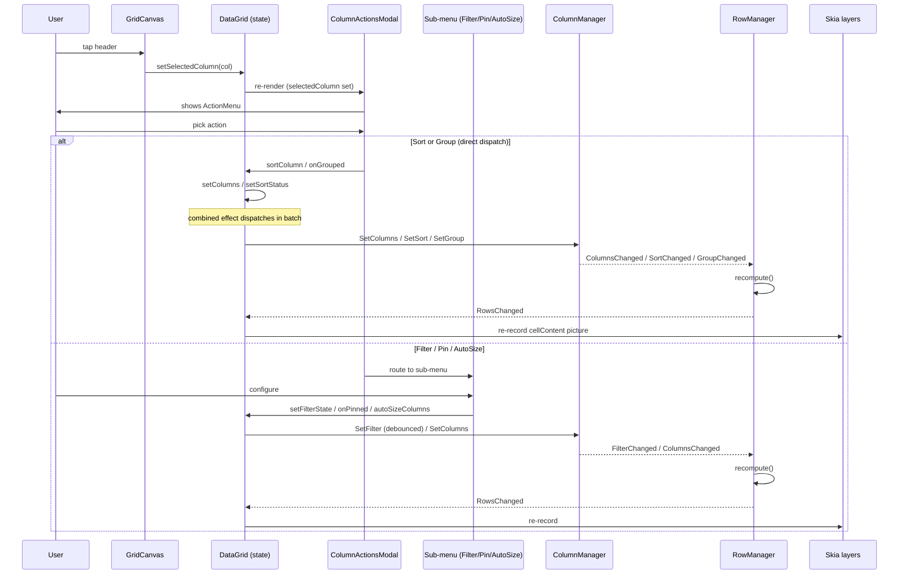

### `ColumnActionsModal`

[src/columnActions/ColumnActionsModal.tsx](../src/columnActions/ColumnActionsModal.tsx) — top-level BottomSheet wrapper. Visible iff `selectedColumn` is set and `isColumnResizing` is false. Hosts `ActionMenu` by default; switches to a sub-component when the user picks Filter / Pin / Auto size. Sort and Group buttons in `ActionMenu` dispatch directly without leaving the menu.

The bridge between the modal and `DataGrid` is [`GridActionsContext`](../src/columnActions/context.ts), populated in [DataGrid.tsx:1122-1182](../src/view/DataGrid.tsx#L1122-L1182). All sub-menus call `useGridActions()` to read columns / callbacks.

### Sort — [`sortColumn`](../src/view/DataGrid.tsx#L620-L681)

The `ActionMenu` Sort buttons call `sortColumn(col, isLongPressed, sortByAbsoluteValue)`. The handler:
- Tracks **multi-column sort** when `isLongPressed` is true: appends to existing sorted columns with the next `sortIndex`. Single tap **replaces** the sort (clears all other sortIndex values).
- Returns a new `columns` array with each col's `sort`, `sortIndex`, `sortByAbsoluteValue` updated.
- Calls `setColumns(newCols)`. The combined dispatch effect picks up the change → `SetSort` dispatched in next batch.

### Filter — [`FilterMenu`](../src/columnActions/filter/FilterMenu.tsx)

Routes each entry in `column.filterParams.filters[]` (for `filterType: "multi"`) or the single `column.filterType` to either:
- [`ConditionsList`](../src/columnActions/filter/ConditionsList.tsx) — text/number/date filter with a `CombinedFilterModel` (AND/OR `joinOperator`, multiple `conditions[]`, auto-adds the next condition row when the current one is filled, capped at `maxNumConditions`)
- [`SetFilter`](../src/columnActions/filter/SetFilter.tsx) — distinct-values checkbox list. Distinct values are computed against rows already filtered by **prior** filters (the current filter is sliced out first) so the list stays useful as the user narrows. `null` values means "all checked = filter inactive".

`handleFilterChange(index, filter)` mutates a copy of `filterState`, deletes the entry if all filters become empty, and calls `setFilterState(newMap)`. The actual dispatch is debounced in [DataGrid.tsx:683-697](../src/view/DataGrid.tsx#L683-L697):

```ts
useDebounce(
  () => {
    engine.dispatch({ type: ColumnCommandTypes.SetFilter, filterState } as ColumnManagerCommand<T>);
    resetColumnWidthCache(rowManager.getRows());
  },
  (selectedColumn?.filterParams as FilterParams)?.debounceMs ?? DEFAULT_FILTER_DEBOUNCE_MS,
  [filterState]
);
```

### Pin — [`PinMenu`](../src/columnActions/pin/PinMenu.tsx)

Three buttons (left / none / right) call `onPinned(column, key)`. [`onPinned`](../src/view/DataGrid.tsx#L847-L858) updates the column's `pinned` field and calls `setColumns(...)`. Pin status drives renderer section assignment (Section 9 / Section 10).

### Group — [`onGrouped`](../src/view/DataGrid.tsx#L518-L618)

Toggles `rowGroup` on a column and recomputes `rowGroupIndex` on all grouped columns to keep them dense (0..n-1). Adjusts the `__GROUP__` column's cached width to fit the deepest indented row. Clears selections at the affected level when ungrouping. Calls `setColumns` + `rebuildRows`.

### `ColumnGroupingControl` (drag-reorder pill strip)

[src/view/ColumnGroupingControl.tsx](../src/view/ColumnGroupingControl.tsx) renders a horizontal `DraggableFlatList` of pill-shaped tiles, one per `rowGroup` column, sorted by `rowGroupIndex`. `onDragEnd` rewrites `rowGroupIndex` per pill order and calls `setColumns(newCols)`.

### Autosize Menu — [`AutoSizeMenu`](../src/columnActions/autoSize/AutoSizeMenu.tsx)

Two buttons:
- "Auto size this column" → `autoSizeColumns([column])`
- "Auto size all columns" → `autoSizeColumns(columns.filter(c => !c.hide && !c.checkboxSelection))`

[`autoSizeColumns`](../src/view/DataGrid.tsx#L786-L811) sets each affected column's `width` to `Math.ceil(columnWidthMap.current.get(__id) + 2*CELL_PADDING)`. The cache was populated by `resetColumnWidthCache` / `updateColumnWidthCache` from `font.measureText` calls per row.

### Column chooser

[src/columnChooser/ColumnChooserModal.tsx](../src/columnChooser/ColumnChooserModal.tsx) is a separate, consumer-mounted modal (not stacked under the action menu). It supports drag-to-reorder, show/hide, category filtering, and "apply" vs "apply and save" flows. The output is a flat `ColumnChooserColumn[]` passed to `onAccept(cols, save?)`; consumers translate that back to `columnDefs` and pass them in.

### Resize — handled in the renderer

Column-edge and section-edge resize are detected in `GridCanvas` (Section 10). The drag updates a `headerOverlayColumnWidth` / `sectionOverlayWidth` `SharedValue` for the live preview; on release `handleEnd` commits the new column width via `setColumns(...)`. Because `SetColumns` emits `ColumnsChanged` (not `ColumnsResized`) and the only changed field is `width`, RowManager's reference-equality bail-out skips the row pipeline — but the cell-content picture re-records due to changed column widths.

---

## 9. The Skia renderer: 8 picture layers

[src/renderer/GridCanvas.tsx](../src/renderer/GridCanvas.tsx) is the renderer's entry point. Its visual hierarchy:

```
<GestureDetector gesture={gesture}>
  <Canvas onLayout={...}>
    <VerticalGroup ... />          // composes 8 picture layers
  </Canvas>
</GestureDetector>
<CellEditingModal ... />           // sibling RN view, mounted conditionally
```

[`VerticalGroup`](../src/renderer/VerticalGroup.tsx) is the picture composer. For each section (`left` | `center` | `right`):

```tsx
<Group transform={contentTransform[section]} clip={clip[section]}>
  <Picture picture={cellBackground[section]} />
  <Picture picture={cellOverlay[section]} />
  <Picture picture={cellContent[section]} />
</Group>
<Group transform={headerTransform[section]} clip={clip[section]}>
  <Picture picture={headerBackground[section]} />
  <Picture picture={headerOverlay[section]} />
  <Picture picture={headerContent[section]} />
</Group>
```

Plus two section separators (left / right) and a global `noDataPicture` overlay. Total layers = 3 cell + 3 header per section × 3 sections + 2 separator pictures + 2 section overlay pictures + 1 noData = the **"8-layer cascade"** language used in the perf doc.

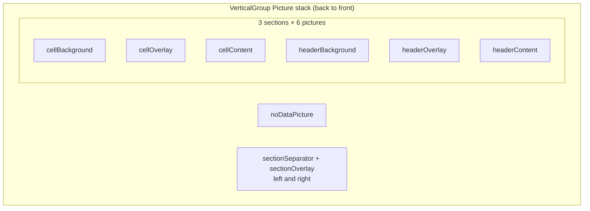

### Each picture is recorded by a hook

[src/renderer/gridLayers.ts](../src/renderer/gridLayers.ts) exports factory functions like `createCellContentLayer`, `createHeaderContentLayer`, `createCellBackgroundLayer`, `createNoDataLayer`. Each:

```ts
function recordPicture(xywh, [fontManager, theme], cb) {
  const recorder = Skia.PictureRecorder();
  const canvas = recorder.beginRecording(Skia.XYWHRect(...xywh));
  cb(getDrawingCtx(canvas, width, height, fontManager, theme));
  return recorder.finishRecordingAsPicture();
}
```

Each layer has a hook in [src/renderer/layers/](../src/renderer/layers/) (`useCellContent`, `useHeaderContent`, `useCellBackground`, `useCellOverlay`, `useHeaderBackground`, `useHeaderOverlay`, `useSectionSeparator`, `useSectionOverlay`). The hook:
- Holds a `SharedValue<SkPicture>` per section
- Has a `React.useEffect([deps...])` that calls the layer factory and assigns the result to the SharedValue
- For scroll-driven layers (cellContent, headerContent, cellBackground), uses `useAnimatedReaction` to monitor `y`/`x` SharedValues and `runOnJS(updateLayer)` only when scroll has moved past **half a row buffer** vertically or **half a column buffer × MIN_COLUMN_SIZE** horizontally — avoids re-recording every frame

### Drawing primitives

- [`drawing/drawMethods.ts`](../src/renderer/drawing/drawMethods.ts) — `drawText`, `drawRect`, `drawLine`, `drawDashedLine`, `drawTruncatedText`, `drawCheckbox`, `drawDataGridCell`, `renderRowCell` (dispatches to custom `cellRenderer` if set, else default), `drawNoData`, etc.
- [`drawing/fontUtils.ts`](../src/renderer/drawing/fontUtils.ts) — `getFont` (LRU 64) + `getTextWidth` (LRU 2000) caches. Hit rate ~95% after first render.
- [`drawing/paintFactory.ts`](../src/renderer/drawing/paintFactory.ts) + `drawingPrimitives.ts` — `getFillPaint`, `getStrokePaint`, paragraph LRU (2000 entries).

### Built-in cell renderers

- [`GroupCellRenderer`](../src/renderer/cellRenderers/GroupCellRenderer.tsx) — caret icon (`faCaretDown` / `faCaretRight`) + indent by `5 × level` + value or empty-set icon. Used by the auto-prepended `__GROUP__` column.
- [`SelectionCellRenderer`](../src/renderer/cellRenderers/SelectionCellRenderer.tsx) — checkbox via `drawSelectionCheckbox`. Used by the auto-prepended selection column.

Custom renderers receive a `DrawingContext` and the canvas is `clipCell`-scoped to the cell rect, so renderers can draw freely without worrying about bleed.

---

## 10. Scroll, pan, and hit testing

### Scroll offsets — Reanimated SharedValues

`GridCanvas` holds four scroll offsets, each a `useSharedValue<number>(0)`:
- `y` — global vertical scroll (shared across sections)
- `pinnedX` — horizontal scroll inside the left-pinned section (independent)
- `unpinnedX` — horizontal scroll inside the center section
- `rightPinnedX` — horizontal scroll inside the right-pinned section

Each section has its own X because pinned sections do not pan with the center. They each have their own clamp (`[-(sectionContentWidth - sectionViewportWidth), 0]`).

### Gesture composition — `Gesture.Race`

[src/renderer/interaction/useGridGestures.ts:36-79](../src/renderer/interaction/useGridGestures.ts#L36-L79):

```ts
export function useGridGestures(args) {
  const tap       = Gesture.Tap().runOnJS(true).onStart(...)  .onEnd((p) => handleEnd(p, false));
  const longPress = Gesture.LongPress().minDuration(LONG_PRESS_DURATION).runOnJS(true)
                                       .onStart((p) => draw(p, START, true))
                                       .onEnd  ((p) => handleEnd(p, true));
  const scroll    = Gesture.Pan().runOnJS(true)
                                 .onBegin ((p) => draw(p, START))
                                 .onChange((p) => draw(p, ACTIVE))
                                 .onEnd   ((p) => handleEnd(p, false));
  return Gesture.Race(tap, scroll, longPress);
}
```

`Gesture.Race` means the first gesture to meet activation criteria wins. A 1px pan flips a tap into a scroll.

All three callbacks run on the JS thread (`runOnJS(true)`) — the worklet thread is reserved for the derived transforms and clip rects. The grid intentionally does not animate the pan itself; raw pan deltas are written directly into the SharedValues so the user gets 1:1 finger tracking.

### Pan path

`GridCanvas`'s `onActive` handler reads `pos.changeY` / `pos.changeX` and assigns into the right SharedValue based on `inPinnedXRef.current` / `inRightPinnedXRef.current` (set during `onStart` from the touch X position):

```ts
y.value += pos.changeY;
if (inPinnedXRef.current)         pinnedX.value      += pos.changeX;
else if (inRightPinnedXRef.current) rightPinnedX.value += pos.changeX;
else                               unpinnedX.value    += pos.changeX;
```

### Pan end — momentum

[`scrollPhysics.ts`](../src/renderer/interaction/scrollPhysics.ts):

```ts
export function applyScrollDecay(target, velocity, clamp: [number, number]) {
  target.value = withDecay({ velocity, velocityFactor: VELOCITY_FACTOR, clamp });
}
```

`withDecay` is Reanimated's exponential decay animation — it runs entirely on the worklet thread, no JS bridge per frame. Clamp bounds stop the animation cleanly at section edges.

### Section transforms

`useDerivedCellTransform` composes per-section `[{translateY: y}, {translateX: sectionX}]` transforms with `translationClamp` (in [`sectionWidthUtils.ts`](../src/renderer/sectionWidthUtils.ts)) keeping each axis inside its valid range. `useHeaderTransform` strips `translateY` from each section's content transform and forces `{translateY: 0}` so headers stay locked vertically while still panning horizontally with their section. `useDerivedClip` derives the per-section visible rect (offset by prior section widths + separator widths).

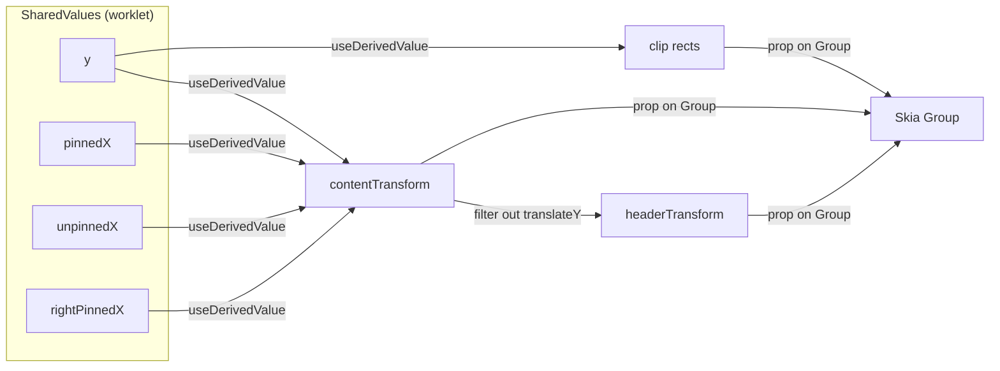

### Hit testing

`GridCanvas.onStart` caches all four offsets. On tap end (no drag), `handleRowPress` derives:
- **Row index**: `Math.floor((|offsetY| - totalHeaderHeight - (topRowNode ? rowHeight : 0)) / rowHeight)`. Negative ⇒ tap was in the header band.
- **Column**: `getColumn()` decides which section was tapped (compare absolute X against `widthsRef.current.left` and `layout.value.width - widthsRef.current.right`), then `getColumnAtX(sectionColumns, sectionLocalX)` walks the columns summing widths.
- If header tapped → `setSelectedColumn(col)` → `ColumnActionsModal` opens
- If row tapped, column is editable → `setSelectedCellParams({ cellEditingParams })` → `CellEditingModal` mounts
- If row tapped, column is the `__GROUP__` column → `setRowExpandedState(row, !row.expanded)`
- Otherwise → fire `onRowPress(row, col, pressCount)` and (optionally) toggle selection

### Resize hit slop

Inside `onStart`, `resizeIconClicked()` checks whether the tap landed within ±20px of a column's right edge while a column is selected. `resizeSectionIconClicked()` checks `RESIZE_ICON_WIDTH/2` around either section boundary. Either result sets `isColumnResizing` / `isSectionResizing` and during `onActive` the live width is written into `headerOverlayColumnWidth` / `sectionOverlayWidth` SharedValues (driving the blue overlay rectangle in the header/section overlay layers). On `handleEnd`, the new width is committed via `setColumns(...)`.

---

## 11. End-to-end traces (sequence diagrams)

### Trace A — User taps a cell

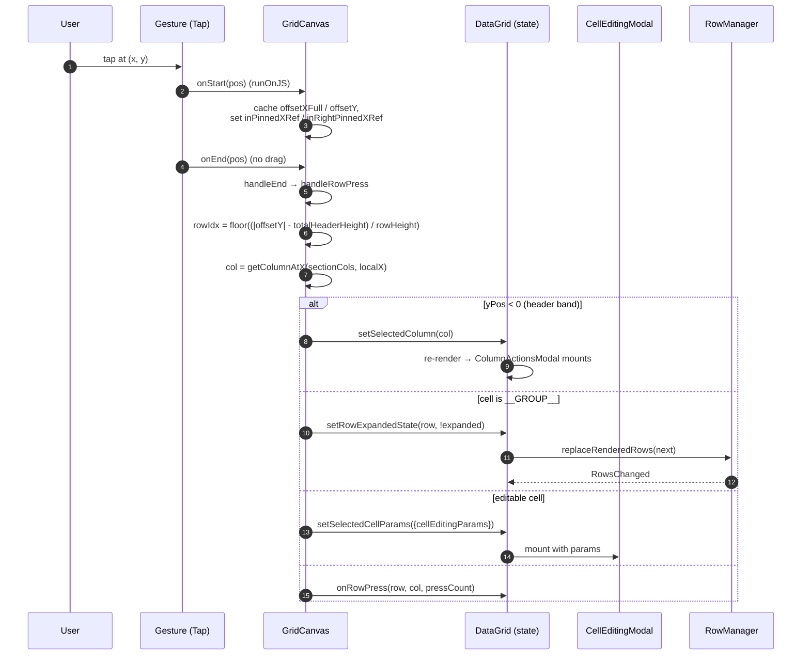

Key file refs: gesture in [useGridGestures.ts:36-79](../src/renderer/interaction/useGridGestures.ts#L36-L79); hit test (`handleRowPress`, `getColumn`, `resizeIconClicked`) is inside [`GridCanvas.tsx`](../src/renderer/GridCanvas.tsx); state setters in [DataGrid.tsx:770-784](../src/view/DataGrid.tsx#L770-L784) (`handleRowPress`).

### Trace B — User filters a column

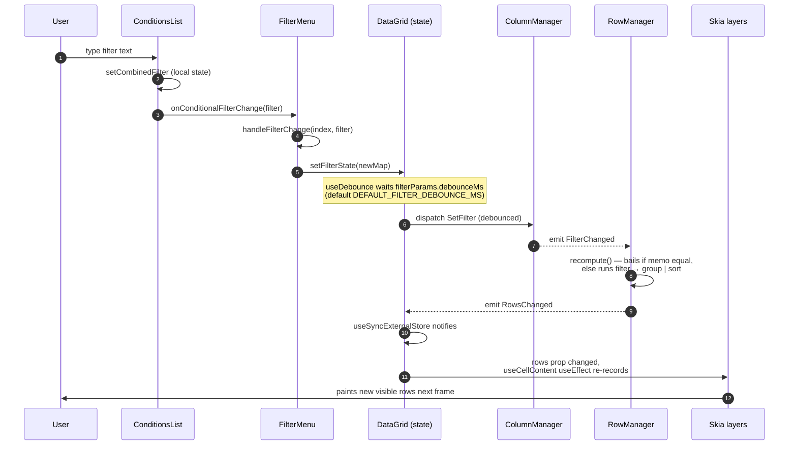

Key file refs: [`ConditionsList.tsx`](../src/columnActions/filter/ConditionsList.tsx) for the input → CombinedFilterModel logic; [`FilterMenu.tsx:handleFilterChange`](../src/columnActions/filter/FilterMenu.tsx); [DataGrid.tsx:683-697](../src/view/DataGrid.tsx#L683-L697) for the debounced dispatch; [ColumnManager.ts:145-148](../src/core/managers/ColumnManager.ts#L145-L148) for the handler; [RowManager.ts:117-120](../src/core/managers/RowManager.ts#L117-L120) for the subscriber; [filter.ts](../src/core/pipeline/filter.ts) for the predicate engine.

### Trace C — User pans the grid

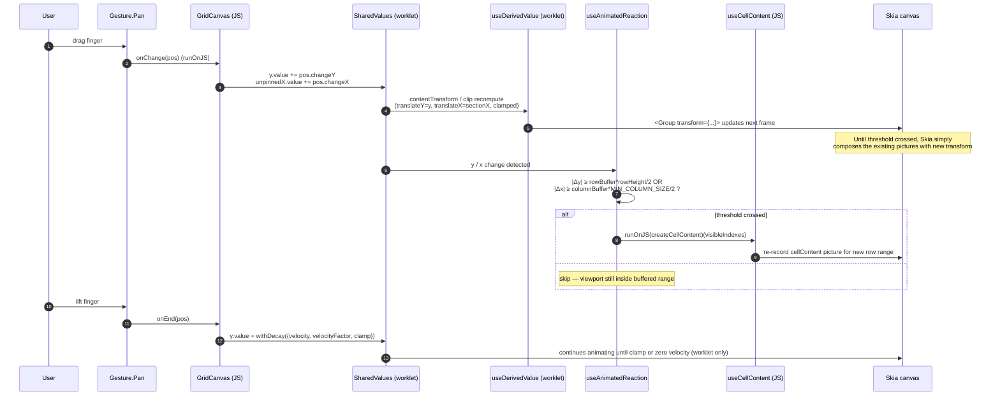

Key file refs: [useGridGestures.ts:66-76](../src/renderer/interaction/useGridGestures.ts#L66-L76) (pan composition); [scrollPhysics.ts](../src/renderer/interaction/scrollPhysics.ts) (decay); [layers/useDerivedCellTransform.tsx](../src/renderer/layers/useDerivedCellTransform.tsx) and [layers/useDerivedClip.tsx](../src/renderer/layers/useDerivedClip.tsx) (transforms); [layers/useCellContent.tsx](../src/renderer/layers/useCellContent.tsx) (threshold + bridge to JS for re-record).

---

## 12. Constants & gotchas

### Constants worth knowing — [src/utils/constants.ts](../src/utils/constants.ts)

| Constant | Purpose |
|---|---|
| `GROUP_KEY_SEPARATOR = "§"` | hierarchical group key joiner ("A§B§C") |
| `GROUP_COLUMN_ID = "__GROUP__"` | magic id for the auto-prepended group column |
| `GROUP_COLUMN_NAME = "Group"` | default header for the auto-prepended group column |
| `CHECKBOX_COLUMN_HEADER = "__root__"` | key in `nodesSelection` for the header checkbox tri-state |
| `CELL_PADDING`, `EDITABLE_CELL_PADDING`, `GROUPED_ROW_PADDING` | px paddings inside cells / per nesting level |
| `ROW_HEIGHT_DEFAULT = 30`, `HEADER_ROW_HEIGHT_DEFAULT = 25` | default row / header heights |
| `ROW_FONT_SIZE_DEFAULT = 15`, `HEADER_FONT_SIZE_DEFAULT` | default font sizes |
| `FONT_WIDTH_ADJ_MULTIPLIER ≈ 1.09` | empirical adjustment over `font.measureText(...).width` |
| `LONG_PRESS_DURATION` | ms threshold for `Gesture.LongPress` |
| `MIN_COLUMN_SIZE`, `MIN_SECTION_SIZE`, `RESIZE_ICON_WIDTH` | minimums + hit-slop constants |
| `VELOCITY_FACTOR` | `withDecay` deceleration factor on scroll release |
| `DEFAULT_FILTER_DEBOUNCE_MS` | filter input debounce (overridable per column via `filterParams.debounceMs`) |

### Gotchas

- **`getRowId` is effectively required for any non-trivial data.** Without it, every `transformDataToRowNode` call generates fresh UUIDs and breaks any ID-keyed maps (selection, expansion).
- **Don't reach into `lastInputs` from outside `recompute()`.** The only legitimate write is `this.lastInputs = null` inside the `Recompute` command.
- **Don't dispatch column commands outside `engine.batch(...)` when issuing 2+ together.** Without batching, intermediate `RowsChanged` emits cause consumers to race the partially-updated state.
- **Don't read `rowManager.getRows()` synchronously after a column-side dispatch.** Column dispatches go through ColumnManager → cascade-aware flush → RowManager subscriber. The recompute happens *after* `dispatch()` returns. (Row-side dispatches — `SetRows`, `SetContext`, `SetAggFuncs`, `Recompute` — are synchronous and `getRows()` immediately afterwards is safe.)
- **Don't add row-side handlers for column state.** `SetColumns`/`SetFilter`/`SetSort`/`SetGroup` live exclusively on ColumnManager. Re-adding them to RowManager creates a routing collision with command-string literals like `"columns:set"`.
- **Don't add types outside `core/types/`.** Single source of truth — keeps the public API surface coherent.
- **The Skia canvas is independent of the React DOM theming work.** Density affects canvas sizing via separate `canvasRowHeight` / `canvasHeaderHeight` / `canvasFontSize` tokens (per the [density plan](density-plan.md)). Don't try to push styled-components-style theming into Skia paint code.
- **Pinned sections each have their own X scroll value.** A consumer reading "the scroll offset" needs to know which section it's asking about.
- **Header taps are detected by `yPos < 0`** after the offset math; if you ever change the offset model make sure the band check still holds.
- **The `__GROUP__` and selection columns are auto-prepended inside `setColumns`** ([DataGrid.tsx:441-516](../src/view/DataGrid.tsx#L441-L516)). Column-state APIs that take a flat `columns` array must not include them — `setColumns` will re-add them.

---

That's the runtime. For folder-level orientation see [architectural-overview.md](architectural-overview.md), for the perf model see [performance-optimizations.md](performance-optimizations.md), and for the upcoming styling/density migration see [density-plan.md](density-plan.md).
